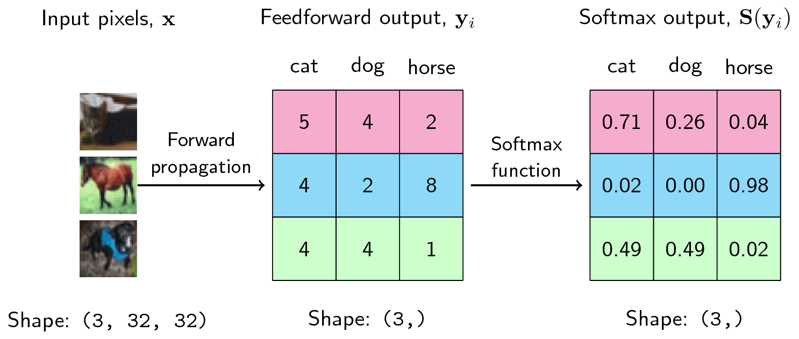

# Architectural Basics
## 1.  Image Normalization

 Image Normalization is a part of image preprocessing. The idea to standardize/normalize the input to network as much as possible            because of following reasons: 
 
**a)** learning is more stable (by reducing variability across the training data)                                                        
**b)** your network will generalize better to novel data (because the normalization reduces the variability between your training               and test data)                                                                                                                    
**c)** the inputs will fall within the useful range of your nonlinearities                                                                

  there are three common techniques for image normalization: 
  
  **i.** Bring Pixel values in range of 0 to 1                                                                                            
  **ii.**  Bring Pixel values in range of -1 to 1                                                                                        
  **iii.** Bring Pixel values in range of 0 mean and  1 std dev 

## 2.  Receptive Field
Our objective is to have the final global receptive field (at the final prediction layer or output layer) to be equal to the size of the object. This is important as the network needs to "see" the whole image before it can predict exactly what the image is all about. 
This would mean that we need to add as many layers are required to reach the final receptive field equal to the size of the object.
 

Here in first layer as a 5x5 image, convolving  with a kernel of size 3x3, and hence the resulting output resolution will be a channel with 3x3 pixels/values. In second layer when we convolve on this 3x3 channel(last result) with a kernel of size 3x3, we will get only 1 output. 
The final output of 1 or 1x1, we could have used a 5x5 kernel directly. 
This means that using a 3x3 kernel twice is equivalent to using a 5x5 kernel. This also means that two layers of 3x3 have a resulting receptive field of 5x5. 

### 3.  MaxPooling
MaxPooling helps to reduce the number of layers count significantly along with doubling the receptive field than previous layer. In our MNIST dataset example to reach from input image 28x28 to 1x1 size we need 14 layers. But with 2 maxpooling layers we need only 8 layers. 
We prefer 2x2 maxpooling instead 3x3 to keep data loss minimum level. Following images tells how maxpooling operation works.

### 4.  How many layers 
   Number of layers need to include to have whole input image object view or global receptive field of object at final prediction layer.
   The no of layers are required without maxpooling is more than with maxpooling.        

### 5.  Kernels and how do we decide the number of kernels?
Kernels are feature extractors, used to extract different features from input image. The number of kernels required to have atleast more than number of classes count. We gradually increase number of kernels as we proceed from begining to prediction layer. Sometimes we learned new features with kernels or combine large learned kernels to small kernels count.

### 6.  3x3 Convolutions
3x3 convolutions are used to learn new features. They are symmetric about origin which is good. 3x3 convolution looking at a 3x3 area, we are looking at 9 multiplications and the sum of the resulting 9 multiplications being passed on to the output. 

By changing 3x3 convolution values, we can obtain different results.(Horizontal/vertical/diagonal lines)

### 7.  Position of MaxPooling
Our Network should learn **edges and gradients -> texture and patterns -> parts of objects  -> objects**, as we proceed from begining to prediction layer. Maxpooling is used only after network learned above things completely to avoid loss of important learned features.
Also its recommended not to use maxpooling close to begining and end of network to avoid unrecoverable data loss.

### 8.  Concept of Transition Layers
Transition layers are used in between two convolution blocks. It consists of maxpooling and 1x1 convolutions. So that we can reduce image channels resolution and channels depth which is at the input of transition layer, before passing to next convolution block.

### 9.  1x1 Convolutions
Instead of learning new features, combining large number of features into complex small number, is achieved by 1x1 convolution.
1x1 Covolution benefits:                                                                                                                  
**a)** 1x1 is computation less expensive.                                                                                                
**b)** 1x1 is not even a proper convolution, as we can, instead of convolving each pixel separately, multiply the whole channel with          just 1 number                                                                                                                        
**c)** 1x1 is merging the pre-existing feature extractors, creating new ones, keeping in mind that those features are found together (like edges/gradients which make up an eye)                                                                                              
**d** 1x1 is performing a weighted sum of the channels, so it can so happen that it decides not to pick a particular feature which defines the background and not a part of the object.

### 10. Position of Transition Layer
Transition layers are placed between convolution blocks. Only quality required features are selected from previous convolution block and feed to next convolution block.

### 11. The distance of MaxPooling from Prediction
The position of maxpooling is a way from prediction layer to avoid loss of high quality features learned.
### 12. SoftMax
Softmax is not probability, but probability like! It's used in last prediction layer to maximize distance between different classes score and represent in terms of numbers. All class values prediction score sum to 1. Generally in real life critical situation softmax is not prefered. Its just to make us happy to see prediction score. :)

### 13. Learning Rate

### 14. Batch Size, and effects of batch size

### 15. When to add validation checks

### 16. Number of Epochs and when to increase them

### 17. How do we know our network is not going well, comparatively, very early

### 18. Batch Normalization

### 19. The distance of Batch Normalization from Prediction

### 20. DropOut

### 21. When do we introduce DropOut, or when do we know we have some overfitting

### 22. LR schedule and concept behind it

### 23. Adam vs SGD

### 24. When do we stop convolutions and go ahead with a larger kernel or some other   	alternative (which we have not yet covered)

